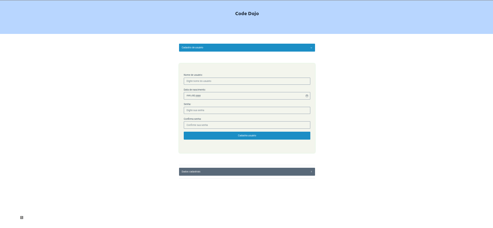
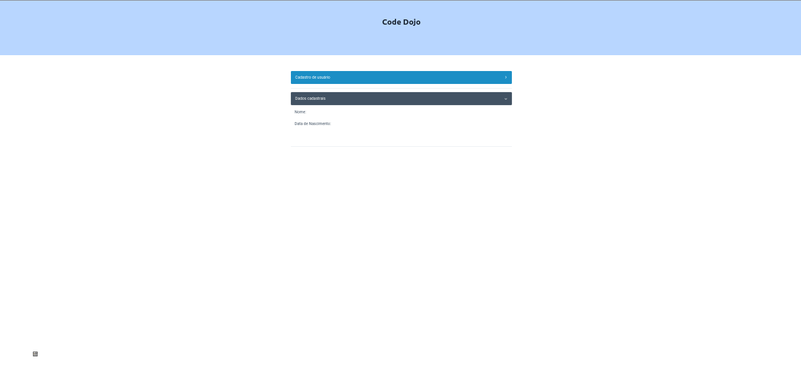

# React Code Dojo

## Temas abordados

- Formulários
- Controle de estado
- Eventos da DOM

## Requisitos

### Você precisará ter instalado na sua máquina:

- Node.js versão >=16 [(Instale apartir daqui)](https://nodejs.org/pt-br/download/)
- Git

## Instruções para rodar aplicação

1. Clone este repositório
2. Acesse o diretório criado após clonagem
3. Execute o comando `npm install`
4. Após instalação execute o comando `npm run dev` para executar servidor de desenvolvimento da aplicação

## Desafio

A aplicação consiste numa tela de cadastro de usuário contendo duas seções:

- formulário de cadastro
  
- visualização de dados do usuário cadastrado
  

O desafio consiste nos seguintes requisitos:

- criar lógica que permita cadastrar o usuário e executar ação de submissão do formulário, sem recarregar a tela;
- exibir dados do usuário cadastrado, na seção dados cadastrais, após submissão do formulário da seção Cadastro do usuário

### Bônus

- Controlar abertura do acordeão que exibe seções da tela utilizando alguma forma de controle de estado
- Componentizar um ou mais elementos da tela para melhorar organização e apresentação do código

**Importante: O código deve ser desenvolvido utilizando Typescript**

## Solução

São propostas duas soluções:

- Uma solução mínima que atenda todos os requisitos e bônus
- Uma solução que corresponde a abordagem do autor deste repositório

### Ferramentas e bibliotecas utilizadas

Esta aplicação foi construída utilizando

- [ViteJS](https://vitejs.dev/)
- [React](https://beta.reactjs.org/)
- [Typescript](https://www.typescriptlang.org/)
- [picocss](https://picocss.com/docs/forms.html)
